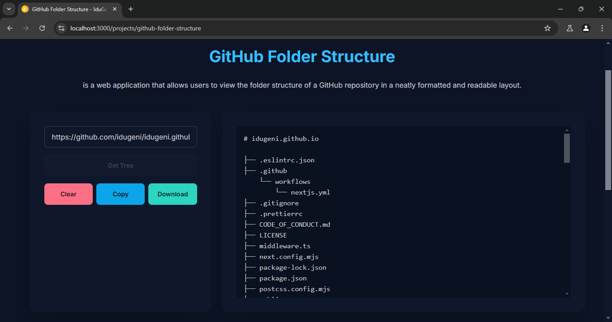

# GitHub Folder Structure


<div align="center">
  


</div>

## 📜 Description
**GitHub Folder Structure** is a web application that allows users to view the folder structure of a GitHub repository in a neatly formatted and readable layout. The application supports fetching data from the main branches like `main` or `master` and displays the result in a format that can be downloaded as a Markdown file.

<div align="center">

[](https://idugeni.vercel.app/projects/github-folder-structure)

</div>

## 🚀 Features
- **Folder Structure Visualization**: View the folder structure of a GitHub repository in a clear and structured format.
- **Download as Markdown**: Download the folder structure as a `.md` file.
- **Copy to Clipboard**: Easily copy the folder structure to your clipboard.
- **Interactive Notifications**: Get notifications whenever you perform an action (copy, clear, download) for a better user experience.

## 🎨 Interface


## ⚙️ How to Use
1. **Enter Repository URL**: Input the URL of the GitHub repository whose structure you want to view.
2. **Click "Get Tree"**: Click this button to fetch the folder structure of the repository.
3. **View Result**: The folder structure will be displayed on the right side.
4. **Download**: You can download the result as a Markdown file.
5. **Copy**: Copy the result to your clipboard if needed.
6. **Clear**: Clear the input and results if you want to try another URL.

## 💻 Installation and Usage

1. **Create a new page**: Inside your Next.js project, navigate to your `pages` or `app` directory and create a new file named `github-folder-structure.tsx`.

2. **Copy and paste the code**: Paste the following TypeScript code into the newly created `github-folder-structure.tsx` file.

```typescript
'use client'

import { useState, useEffect } from 'react'

export default function GithubFolderStructure () {
  const [url, setUrl] = useState<string>('')
  const [tree, setTree] = useState<string>('')
  const [loading, setLoading] = useState<boolean>(false)
  const [error, setError] = useState<string>('')
  const [notification, setNotification] = useState<
    { message: string; type: 'success' | 'info' | 'error' } | ''
  >('')
  const [isGetTreeDisabled, setIsGetTreeDisabled] = useState<boolean>(false)

  interface TreeItem {
    path: string
  }

  const extractOwnerRepo = (url: string): { owner: string; repo: string } => {
    const parts = url.split('/')
    const owner = parts[parts.length - 2]
    const repo = parts[parts.length - 1]
    return { owner, repo }
  }

  const getDefaultBranch = async (
    owner: string,
    repo: string
  ): Promise<string | undefined> => {
    try {
      const repoRes = await fetch(
        `https://api.github.com/repos/${owner}/${repo}`
      )
      if (!repoRes.ok) throw new Error('Error fetching repository info')
      const repoData = await repoRes.json()
      return repoData.default_branch || 'main'
    } catch (err: any) {
      setError(`Error fetching the repository data: ${err.message}`)
      console.error(err)
    }
  }

  const getTree = async (
    owner: string,
    repo: string,
    branch: string
  ): Promise<TreeItem[] | undefined> => {
    try {
      const commitRes = await fetch(
        `https://api.github.com/repos/${owner}/${repo}/commits/${branch}`
      )
      if (!commitRes.ok) throw new Error('Error fetching commit data')
      const commitData = await commitRes.json()
      const sha = commitData.sha

      const treeRes = await fetch(
        `https://api.github.com/repos/${owner}/${repo}/git/trees/${sha}?recursive=1`
      )
      if (!treeRes.ok) throw new Error('Error fetching tree data')
      const treeData = await treeRes.json()
      return treeData.tree
    } catch (err: any) {
      setError(`Error fetching the repository data: ${err.message}`)
      console.error(err)
    }
  }

  const buildMarkdownTree = (tree: TreeItem[]): string => {
    if (!Array.isArray(tree)) {
      return ''
    }

    let treeDict: { [key: string]: any } = {}
    tree.forEach((item: TreeItem) => {
      const parts = item.path.split('/')
      let current = treeDict
      parts.forEach((part: string, index: number) => {
        if (!current[part]) {
          current[part] = index === parts.length - 1 ? null : {}
        }
        current = current[part]
      })
    })

    const formatTree = (
      tree: { [key: string]: any },
      level: number = 0
    ): string => {
      if (typeof tree !== 'object' || tree === null) {
        return ''
      }

      const sortedKeys = Object.keys(tree).sort((a, b) => {
        const isADot = a.startsWith('.')
        const isBDot = b.startsWith('.')
        if (isADot && !isBDot) return -1
        if (!isADot && isBDot) return 1
        if (isADot === isBDot) return a.localeCompare(b)
        return 0
      })

      return sortedKeys
        .map((key: string, index: number) => {
          const indent = '    '.repeat(level)
          const connector = index === sortedKeys.length - 1 ? '└── ' : '├── '
          return `${indent}${connector}${key}\n${formatTree(
            tree[key],
            level + 1
          )}`
        })
        .join('')
    }

    return formatTree(treeDict)
  }

  const handleSubmit = async (
    e: React.FormEvent<HTMLFormElement>
  ): Promise<void> => {
    e.preventDefault()
    setLoading(true)
    setError('')
    const { owner, repo } = extractOwnerRepo(url)
    const branchName = await getDefaultBranch(owner, repo)
    if (branchName) {
      const treeData = await getTree(owner, repo, branchName)
      if (treeData) {
        const markdown = `# ${repo}\n\n${buildMarkdownTree(treeData)}`
        setTree(markdown)
        setIsGetTreeDisabled(true)
        showNotification('Generated successfully!', 'success')
      }
    }
    setLoading(false)
  }

  const handleClear = (): void => {
    setUrl('')
    setTree('')
    setIsGetTreeDisabled(false)
    showNotification('Cleared successfully!', 'success')
  }

  const handleCopy = (): void => {
    navigator.clipboard.writeText(tree)
    showNotification('Copied to clipboard!', 'info')
  }

  const handleDownload = (): void => {
    const { repo } = extractOwnerRepo(url)
    const blob = new Blob([tree], { type: 'text/markdown' })
    const a = document.createElement('a')
    a.href = URL.createObjectURL(blob)
    a.download = `${repo}.md`
    a.click()
    URL.revokeObjectURL(a.href)
    showNotification('Download started!', 'success')
  }

  const showNotification = (
    message: string,
    type: 'success' | 'info' | 'error'
  ): void => {
    setNotification({ message, type })
    setTimeout(() => setNotification(''), 3000)
  }

  useEffect(() => {
    const titleTag = document.querySelector('title') as HTMLTitleElement
    const metaDescription = document.querySelector(
      'meta[name="description"]'
    ) as HTMLMetaElement

    if (titleTag) {
      titleTag.innerText = `GitHub Folder Structure - IduGeni SabdoDadi`
    }

    if (metaDescription) {
      metaDescription.content =
        'View the folder structure of a GitHub repository in a neat layout.'
    }
  }, [])

  useEffect(() => {
    if (url.trim() === '' && tree.trim() === '') {
      setIsGetTreeDisabled(false)
    }
  }, [url, tree])

  return (
    <section className='py-8 md:py-12 lg:py-16 bg-base-200 text-base-content'>
      <div className='container mx-auto px-4 md:px-6 lg:px-8'>
        <h1 className='text-2xl md:text-3xl lg:text-4xl font-bold mb-8 text-center text-primary'>
          GitHub Folder Structure
        </h1>
        <p className='text-center mb-12'>
          is a web application that allows users to view the folder structure of
          a GitHub repository in a neatly formatted and readable layout.
        </p>
        <div className='flex flex-col md:flex-row w-full max-w-7xl gap-6'>
          {/* Input Column */}
          <div className='card flex-none w-full md:w-1/2 lg:w-1/3 shadow-2xl bg-base-100'>
            <div className='card-body'>
              <form onSubmit={handleSubmit} className='form-control'>
                <div className='mb-4'>
                  <input
                    type='text'
                    placeholder='Enter GitHub repo URL'
                    value={url}
                    onChange={(e) => setUrl(e.target.value)}
                    className='input input-bordered w-full'
                    required
                  />
                </div>
                <button
                  type='submit'
                  className={`btn ${
                    isGetTreeDisabled ? 'btn-secondary' : 'btn-primary'
                  } w-full`}
                  disabled={isGetTreeDisabled}
                >
                  Get Tree
                </button>
                <div className='flex flex-wrap gap-2 mt-4'>
                  <button
                    type='button'
                    className='btn btn-error flex-1'
                    onClick={handleClear}
                  >
                    Clear
                  </button>
                  <button
                    type='button'
                    className='btn btn-info flex-1'
                    onClick={handleCopy}
                  >
                    Copy
                  </button>
                  <button
                    type='button'
                    className='btn btn-success flex-1'
                    onClick={handleDownload}
                  >
                    Download
                  </button>
                </div>
                {/* Notification Area */}
                {notification && (
                  <div className='mt-4 text-center'>
                    <div
                      className={`p-4 rounded-md text-white shadow-lg ${
                        notification.type === 'success'
                          ? 'bg-green-500'
                          : 'bg-blue-500'
                      }`}
                    >
                      {notification.message}
                    </div>
                  </div>
                )}
              </form>
              {loading && (
                <progress className='progress w-full mt-4'></progress>
              )}
              {error && <p className='text-red-500 mt-4'>{error}</p>}
            </div>
          </div>
          {/* Output Column */}
          <div className='card flex-none w-full md:w-1/2 lg:w-2/3 shadow-2xl bg-base-100'>
            <div className='card-body'>
              <pre className='whitespace-pre p-4 bg-base-300 rounded-md overflow-x-auto overflow-y-auto h-96'>
                {tree}
              </pre>
            </div>
          </div>
        </div>
      </div>
    </section>
  )
}
```

## 🛠️ Technologies Used
- **Next.js**: A React framework for building web applications.
- **Tailwind CSS**: A utility-first CSS framework for fast and efficient styling.
- **GitHub API**: API for fetching data from GitHub repositories.

## 🌟 Contributions
If you would like to contribute, please fork this repository and submit a pull request with the changes you wish to propose. All types of contributions are welcome, whether it's adding new features, fixing bugs, or improving documentation.

## 📄 License
This project is licensed under the [](./LICENSE)
